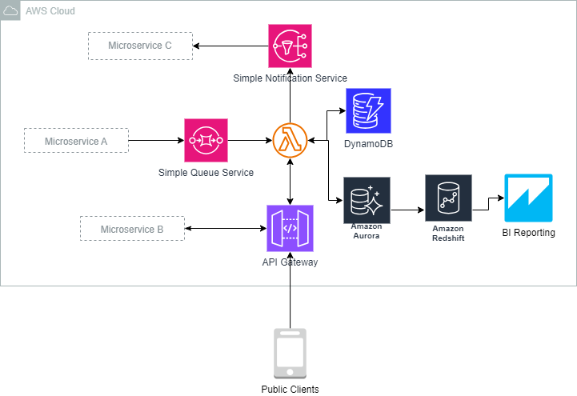

# Generic Microservice Example
 This architecture represents a generic serverless service on AWS with its own dedicated datastore. There are many integration points to this service including API Gateway and SQS, while other services can listen to events emitted by this service during the workflow.
 The data used in this architecture can be exported to other destinations depending on the use case. I have built numerous services using this architecture in B2C applications. 
 This entire architecture is deployed and maintained using AWS CDK. This is just a sample architecture, and not limited to the services listed.

 ## Deployment
 When using serverless technologies such as Lambda, I typically like to use CDK to develop and deploy them onto the cloud. This ensures that the functions can be easily tested before any deployment, and streamlines the process of getting them onto the cloud.
 This also helps with configuring roles and permissions for dependent services.

](https://github.com/tal-sabas/aws-projects/blob/master/Generic%20Microservice/Generic%20Microservice.png)
